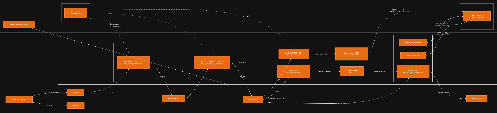
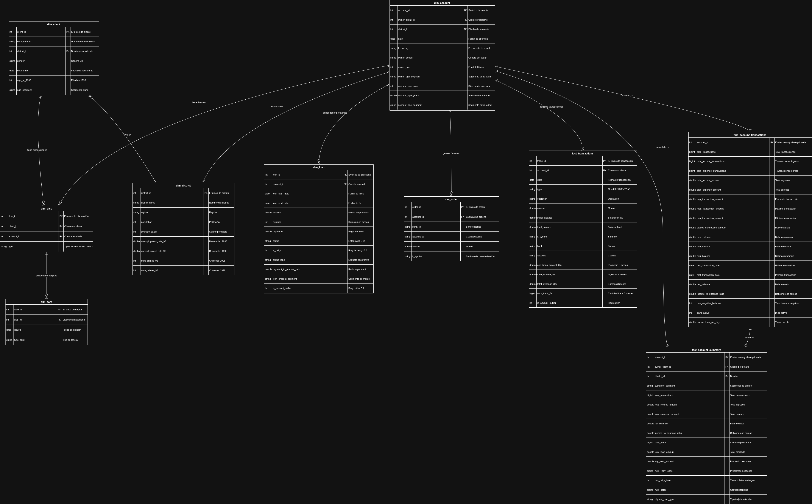

<!-- Banner: logo a la derecha, título a la izquierda -->
<div style="display: flex; justify-content: space-between; align-items: center; width: 100%;">
  <div>
    <h1>🏗️ Arquitectura del Proyecto ETL – Berka Fintech</h1>
    <p>
    En este documento presento la arquitectura que diseñé y ejecuté para el procesamiento analítico del histórico bancario Berka, siguiendo un enfoque Data Lakehouse sobre AWS. Toda la solución está orientada a lograr un pipeline reproducible, escalable y seguro, que permita transformar datos crudos en información confiable para análisis y visualización ejecutiva.

  Mi diseño integra almacenamiento en S3, procesamiento distribuido con AWS Glue, persistencia relacional en RDS MySQL y consumo analítico desde Athena y QuickSight. Este modelo fue la base de todas las decisiones posteriores en mi ETL, desde la estructura de carpetas hasta la lógica del dashboard.
    </p>
  </div>
  
</div>

## 📐 Diagrama de Arquitectura



La arquitectura se compone de cinco capas:

1. **Ingesta**: Archivos CSV históricos como fuente principal.
2. **Data Lake (S3)**: Tres niveles de calidad → *Raw*, *Processed*, *Curated*.
3. **Procesamiento (AWS Glue)**: Tres Jobs Spark que ejecutan limpieza, enriquecimiento y carga final.
4. **Data Warehouse (RDS MySQL)**: Base relacional para dashboards y exploración rápida.
5. **Capa Analítica**: Athena + QuickSight.

Esta separación por capas me permitió mantener trazabilidad y gobernanza durante todo el ciclo del dato.
---

# 1. 🎯 Visión General de la Arquitectura


Desde el inicio decidí trabajar con un patrón **Data Lakehouse**, porque me permitía combinar:

* **Escalabilidad y bajo costo** de S3 como zona central de datos
* **Procesamiento distribuido** en AWS Glue (PySpark)
* **Consumo relacional** en RDS MySQL para dashboards de baja latencia
* **Consultas ad-hoc** desde Athena sobre archivos Parquet optimizados

Este enfoque me permitió tener un pipeline robusto, modular y fácil de desplegar con IaC.

---

# 3. 🔄 Flujo de Datos End-to-End (Pipeline ETL)

Para orquestar el flujo, implementé **tres Jobs de AWS Glue** desarrollados en PySpark. Cada uno refleja una etapa clara del proceso de calidad del dato.

## 3.1. 🗃️ Origen de Datos

La fuente del proyecto es un conjunto de CSV bancarios históricos (`account.csv`, `client.csv`, `trans.csv`, etc.).
Todos se almacenan inicialmente en la ruta:

```
s3://<bucket>/raw/berka/
```

---

## 3.2. 🧹 Fase 1 — Raw → Processed (Estandarización)

**Job:** `raw_to_processed.py`
**Objetivo:** convertir los datos crudos en datos limpios y tipados.

**Transformaciones clave:**

* Normalización de nombres de columnas (snake_case)
* Eliminación de caracteres erróneos
* Cast de tipos (fechas, enteros, decimales)
* Conversión a **Parquet** para mejorar performance

**Salida:**
`processed/berka/` → mismos campos, pero con coherencia estructural.

---

## 3.3. 🧠 Fase 2 — Processed → Curated (Enriquecimiento)

**Job:** `processed_to_curated.py`
**Objetivo:** construir un modelo dimensional listo para análisis.

**Transformaciones realizadas:**

* Joins entre transacciones, cuentas y clientes
* Cálculo de edad → bucketización de clientes
* Features financieros: ingresos, egresos, ratio de riesgo
* Tablas analíticas finales

  * `dim_customer`
  * `fact_transactions`
  * `dim_accounts`
  * entre otras

**Salida:**
`curated/berka/` → Data Marts listos para consumo BI.

---

## 3.4. 🏦 Fase 3 — Curated → RDS (Persistencia Analítica)

**Job:** `curated_to_rds.py`

Decidí cargar la capa Curated en MySQL RDS para brindar:

* Baja latencia en dashboards
* SQL transaccional optimizado
* Facilidad para QuickSight

Incluye creación automática de tablas + carga incremental/batch.

---
Aquí tenés la versión **en primera persona**, con un tono **profesional y académico**, manteniendo toda la estructura y el contenido técnico pero narrado desde tu experiencia directa:

---

# Esquema Estrella (*Star Schema*)



## 1. ⭐️ Modelo de Warehouse: Star Schema (Esquema Estrella)

En el *Data Warehouse* que diseñé sobre MySQL RDS, opté por implementar un modelo de **Esquema Estrella**. Elegí este enfoque porque ofrece una combinación ideal de **simplicidad estructural y alto rendimiento**, especialmente útil para entornos de Inteligencia de Negocio (BI). Esto me permite asegurar que las consultas consumidas desde QuickSight sean consistentes, rápidas y eficientes.

| Característica                | Beneficio Clave                                                                                                                                                   |
| :---------------------------- | :---------------------------------------------------------------------------------------------------------------------------------------------------------------- |
| **Optimización de Consultas** | Simplifico el SQL reduciendo la cantidad de *joins* necesarios, lo que mejora significativamente la latencia del *dashboard*.                                     |
| **Separación de Lógica**      | Mantengo una clara separación entre las **medidas** (hechos) y las **descripciones** (dimensiones), lo que facilita el mantenimiento y la comprensión del modelo. |
| **Escalabilidad**             | Puedo añadir nuevas dimensiones o métricas sin requerir modificaciones estructurales profundas.                                                                   |

---

## 2. Tablas de Hechos (*Fact Tables*)

Las Tablas de Hechos constituyen el núcleo del análisis que construí, ya que contienen los eventos medibles (montos, conteos y métricas derivadas).

| Tabla de Hechos (3)             | Propósito de Negocio                                                                                                                                            | Granularidad                         |
| :------------------------------ | :-------------------------------------------------------------------------------------------------------------------------------------------------------------- | :----------------------------------- |
| **`fact_transactions`**         | Registro cada movimiento financiero (ingresos, retiros y gastos). Esta tabla es clave para identificar anomalías o comportamientos atípicos.                    | Transacción individual               |
| **`fact_account_transactions`** | Agrupo las métricas por cuenta (suma de ingresos, egresos, ratio entre ambos, etc.). Esta tabla me permite medir la salud financiera desde un enfoque agregado. | Cuenta (vista agregada en el tiempo) |
| **`fact_loan_dispositions`**    | Capturo el estado de cada préstamo, lo cual es fundamental para medir el cumplimiento, el *status* y calcular el **capital en incumplimiento**.                 | Préstamo (estado final)              |

---

## 3. Tablas de Dimensión 

Las Tablas de Dimensión son las que me permiten contextualizar los hechos: responden a las preguntas *quién*, *dónde*, *cuándo* y *cómo*.

| Tabla de Dimensión (7)     | Contenido Clave                                                                                        | Relación con Hechos                                              |
| :------------------------- | :----------------------------------------------------------------------------------------------------- | :--------------------------------------------------------------- |
| **`dim_client`**           | Incluyo información demográfica del cliente (género, segmentación por edad).                           | Se relaciona con `fact_transactions` y `fact_loan_dispositions`. |
| **`dim_account`**          | Contiene los datos maestros de cada cuenta (antigüedad, frecuencia).                                   | Se relaciona con todas las tablas de hechos.                     |
| **`dim_district`**         | Agrego información geográfica y socioeconómica (región, salario promedio, desempleo).                  | Se vincula con `dim_account`.                                    |
| **`dim_loan`**             | Registro las características del préstamo (monto, duración, fecha de inicio).                          | Relacionado con `fact_loan_dispositions`.                        |
| **`dim_card`**             | Describo el tipo de tarjeta asignada al cliente.                                                       | Apoya análisis sobre transacciones específicas.                  |
| **`dim_date`**             | Modelo la dimensión temporal (día, semana, mes, año) para permitir análisis evolutivos y estacionales. | Relacionada con todas las tablas de hechos.                      |
| **`dim_transaction_type`** | Incluye el contexto de la transacción (tipo de operación).                                             | Relacionada con `fact_transactions`.                             |

---

### **Resumen**

El *Star Schema* que implementé me permite que todo el trabajo de *Feature Engineering* realizado en las tablas de hechos pueda analizarse rápida y eficientemente bajo cualquier dimensión relevante: cliente, cuenta, geografía, tiempo o tipo de operación. Este diseño asegura flexibilidad para nuevos análisis y un rendimiento óptimo para las herramientas de BI.

---

# 4. 🎛️ Infraestructura como Código (IaC) — CloudFormation

Toda la arquitectura se despliega mediante una plantilla de **CloudFormation**, lo que asegura reproducibilidad. Esto fue clave para que el proyecto pueda levantarse en cualquier entorno sin configuraciones manuales.

### Recursos que provisiono con el template:

| Categoría      | Recurso                                             | Uso y decisión técnica                               |
| -------------- | --------------------------------------------------- | ---------------------------------------------------- |
| **S3**         | Bucket Data Lake (+ prefijos raw/processed/curated) | Base del Lakehouse, escalable y económica            |
| **Glue**       | 3 Jobs Spark + IAM Role                             | Procesamiento distribuido sin servidores             |
| **RDS**        | MySQL 8.0 (db.t3.micro)                             | Data Warehouse para BI                               |
| **Crawler**    | Crawling de Curated                                 | Permite consultas desde Athena                       |
| **Networking** | Security Groups + Subnets + VPC Endpoint            | Comunicación segura Glue ↔ RDS y acceso privado a S3 |

### Seguridad y red

Implementé:

* **Security group self-referencing** para Glue
* **VPC Endpoint para S3** → sin tráfico por internet
* **Acceso a RDS restringido a mi IP real** (extraída automáticamente por el deploy script)

Este diseño fortalece la seguridad sin agregar complejidad administrativa.

---

# 5. 📊 Capa Analítica (Athena + QuickSight)

### **Athena**

La utilicé para:

* Validar la calidad de los Parquet Curated
* Ejecutar el análisis SQL de mi archivo `analisis.md`
* Explorar datos sin cargar RDS

Athena consume los mismos datos de Curated pero sin afectar ambientes productivos.

### **QuickSight**

Lo conecté a:

* **RDS MySQL**, como fuente principal para dashboards
* Athena (para exploración o métricas ad-hoc)

Esto me permitió construir KPIs de riesgo, actividad de clientes y transacciones sospechosas.

---

# 6. 🚀 Despliegue Automatizado — Script `deploy_to_aws_v2.sh`

Desarrollé este script para automatizar el 80% del proceso de despliegue. Su rol es:

1. Validar el entorno (AWS CLI + credenciales)
2. Obtener la IP del equipo para configurar acceso a RDS
3. Crear el stack de CloudFormation
4. Esperar outputs del stack
5. Subir los scripts PySpark a S3
6. Subir los datos RAW
7. Mostrar los comandos manuales que completan la ejecución

### Flujo manual final

Una vez desplegado:

```bash
aws glue start-job-run --job-name <name>-raw-to-processed
aws glue start-job-run --job-name <name>-processed-to-curated
aws glue start-crawler --name <name>-curated-crawler
aws glue start-job-run --job-name <name>-curated-to-rds
```

Esto garantiza que todos los pasos sean intencionales, controlados y reproducibles.

---

# 7. 🧩 Conclusión Técnica

El diseño de esta arquitectura me permitió:

* Trabajar con buenas prácticas reales de un Data Engineer
* Separar calidad de datos por capas
* Mantener un pipeline trazable, seguro y escalable
* Integrar ETL, Data Lake, DWH y BI en un único flujo
* Tener un deploy 100% automatizable

Esta solución representa un Data Lakehouse moderno, accesible, completamente funcional y alineado con escenarios reales del mundo laboral.


